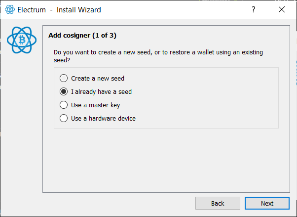

# Intro
This guide will help you create a multisig wallet with the following characteristics:
- Electrum as the software to create and coordinate.
- 2 of 3 signature scheme.
- One online laptop, i.e. connected to Internet.
- One airgapped ColdCard, i.e. not to be connected with a PC ever.
- One or two airgapped laptops, depending if you'll store your seeds in different geographical locations.
- No other parties involved, that is, this is a wallet we are configuring for ourselves.

While we are using a 2 of 3 set-up, the instructions here will serve to a more general multisig structure with as many cosigners as you wish.

Equally important is that I use one Coldcard here, but more are possible. The key is to know how to proceed with at least one. After that, you can follow the same steps if you wish to add more ColdCards to your setup.

Also, if you want to configure your multisig *only* using airgapped ColdCards, then you can just follow the instructions already published by Coinkite here:  
https://www.youtube.com/watch?v=OMpZ5heLsRg

The reason to write this guide is that I didn't find immediately obvious how to create the setup described above. 
In particular, I followed intensively these two guides but in order to get things working, at some point during the process, I had to connect the ColdCard to my computer, which I wanted to avoid at all costs: 
- [How to store your bitcoin in Multisig, by Arman The Parman](https://armantheparman.com/how-to-store-your-bitcoin-detailed-instructions-part-2-multi-signature/)
- [Multisig documentation, by ColdCard](https://coldcard.com/docs/multisig)

My instructions draw a lot from those two, so if you don't mind to connect  a ColdCard via USB, I'd recommend you follow those guides directly, instead of this one.

Without further ado, let's start.

# Create three seeds
As you know by now, a mnemonic seed is a  human-readable representation of a private key. In our multisig set up, 2 of 3, we need to generate three seeds. In the future, we will only use two of them to spend bitcoin from this wallet.

To achieve the generation in a secure way, there are many tutorials and methods. 
I particularly like the 'diceware' method developed by taelfrinn here:  
https://github.com/taelfrinn/Bip39-diceware

This is pretty much a mapping of all BIP39 seed words to a code that you can get using one coin and four dice.

Beware, to complete the previous, you also need to generate the checksum (that is the 12th or the 24th word, depending on how long your seed will be).

If you want to generate the checksum automatically, you can download this html code and run it in an airgapped computer:  
https://github.com/merland/seedpicker/tree/master/calculator 

Arman also provides two guides to generate your seed:  
- [Simple way](https://armantheparman.com/how-to-safely-generate-your-bitcoin-mnemonic-seed-phrases/)
- [Hard way](https://armantheparman.com/bitcoin-seed-with-dice/)

# Initiate ColdCard with the seed you created for it
Since there will be one ColdCard in our setup, we need to store the corresponding seed there. That is, one of the three seeds you have created, will be stored exclusively in your ColdCard and you will use this device to sign transactions with that seed. So, pick one seed and import in in the ColdCard.

ColdCard has an option for importing existing seeds; it's pretty straight forward and well documented, so go ahead and have a look here: 
[Importing or Creating Private Keys](https://coldcard.com/docs/import)

# Set up the airgapped laptop(s)
For this guide, I am assuming that we will have three signing devices distributed geographically. Therefore we will need to set up two airgapped laptops plus one ColdCard. Later on, we shall transport each device to the desired location.

In another very comprehensive guide, Arman explains [how to create an airgapped computer with a Raspberry Pi Zero](https://armantheparman.com/how-to-set-up-a-raspberry-pi-zero-air-gapped-with-electrum-desktop-wallet/). If this is your preferred solution, please follow that guide for the airgapping.

In my case, since I had a couple of old laptops I was not using any longer, I decided to repurpose them as airgapped signing devices.

There are a variety of distributions to choose from, but I went for the 
[Linux Mint](https://linuxmint.com/) one, since it offers some a version for equipments with low resources, such as my old laptops. By the way, you can try installing Linux Mint in a bootable USB and try it; if you like it, you can later on install it in the computer.

# Install Electrum in the airgapped laptop(s)

You will have to install Electrum here from an online computer. Arman also describes that in [this guide](https://armantheparman.com/how-to-set-up-a-raspberry-pi-zero-air-gapped-with-electrum-desktop-wallet/), but I will go ahead and summarize it here:

Get a bootable USB with Linux Mint in it and boot the online laptop. There, start Linux Mint and connect it to the Internet.

Then, go to [Electrum's webpage](http://www.electrum.org/), to the download section and run in your console the command to install dependencies.


While this can change in the future (always check their website), at the moment of writing this, you'll need to run this:

```
sudo apt-get install python3-pyqt5 libsecp256k1-0 python3-cryptography
```
After this, you will see that a bunch of new `.deb` files have been created in the folder 
```
/var/cache/apt/archives/
```

Also, download the package with the `wget` command shown there:
```
wget https://download.electrum.org/4.1.5/Electrum-4.1.5.tar.gz
```

The dependency files and the package need to be transferred to our airgapped laptop. Hence, copy the downloaded `.tar.gz` file to a USB. Additionally, copy to the USB those new `.deb` files from the folder `/var/cache/apt/archives/`

## Let's move now to the airgapped laptop
Once the airgapped laptop has started, copy the files from the USB to a temporary folder in the desktop, for example.

Now, copy all the `.deb` files to the `/var/cache/apt/archives/` folder. From the command line, it would look like this, just replace the correct value for your "origin folder".
```
sudo cp <origin_folder>/*.deb /var/cache/apt/archives/
```
Install the dependencies with this command:
```
sudo dpkg -i *.deb
```
Unpack Electrum in a folder of your choice. In Linux Mint, the graphical interface allows you to do this very easily. If you want to use the command line, copy the Electrum file in the folder of your choice and run this:
```
tar -xvf ElectrumFile.tar.gz
```
Once unzipped, you can run Electrum with the command:
```
./run_electrum
```

This process needs to be repeated in the second airgapped laptop, in order to get Electrum installed there. This will enable our airgapped laptops to be signing devices, each one with their own private key.

# Obtain the master public keys from the seeds
From one of the airgapped laptops we are going to create a temporary wallet with all three seeds in order to obtain the xpubs from all seeds. After this, we will delete that wallet.
If you really want to avoid writing the three seeds in the same computer,then you'll have to take a few more steps and obtaining the xpub of each seed from their own signing device. I believe that the approach I explain here is reasonably secure and less cumbersome, but it's up to you.

Anyway, let's start.  
Open Electrum and go to File > New/Restore. There, select a name for this wallet and click on Next.


Then, choose Multi-signature wallet.


After that, select the structure of your multisig wallet. As we said before, it will be "From 3 cosigners", "Require 2 signatures".


Select "I already have a seed".



Before entering your seed, click on Options and select "BIP39 seed".


After that, enter your seed in the designated text area.


Repeat the same process for the other signatures, using the seeds you have generated. 

In order to retrieve the master public keys for each key, go to Wallet > Information. In the dialog that opens, each of the "keystore" will show a different value in the "Master public key" area. 

Click on the three of them, and copy & paste all keys in a text file elsewhere. Keep the public keys safe and accessible to you, since they are fundamental to retrieve your wallet.

Copy the text file with the public keys to a USB, since we will need it later.

Finally, delete the wallet from Electrum by clicking File > Delete.

# Generate an export file from Electrum to import the wallet in ColdCard

If we check the [ColdCard multisig docs](https://coldcard.com/docs/multisig), we see that Electrum generates a file with a particular format to be imported in ColdCard. 

At the moment of writing, **I only managed to get Electrum to export such file for ColdCard if during the configuration of the wallet if I connected the hardware wallet via USB.** 

We will refine it to match our configuration:
```
# Coldcard Multisig setup file
#
Name: MyMultisigWallet
Policy: 2 of 3
Format: P2WSH

Derivation: m/48'/0'/0'/2'
A7A0A635: Zpub74ksdfR3Vas...SKEid55

Derivation: m/48'/0'/0'/2'
5A17E17C: Zpub74BkEYFAUqNB2DT9jE...r4hirsvo3WFd5eHTxr

Derivation: m/48'/0'/0'/2'
493BAR8F: Zpub74uhWJw3wuBfXoxeWB4W...LLqeqRew1HW8EA1m37Uo4V
```


# Configuring the Multisig wallet in the ColdCard
Import the wallet description file we generated from Electrum

There is an option to "trust public keys" in a msig tx

# Set up the Multisig wallet (watch-only) from the online laptop
Let's move to the online laptop now. We need an online laptop for the following:
- To set up the wallet structure and export it to the other devices.
- To watch the movements of that wallet (check if transactions are going in and out).
- To create unsigned transactions everytime we want to spend our coins from the multisig wallet (these unsigned txs need to be signed by at least 2 of the 3 airgapped devices and then broadcasted to the network)

This process is rather straightforward. We follow the steps to create a new 2-of-3 multi-signature wallet in Electrum. However, for each cosigner, we select the option to "Use a master key" and use the public key we had stored in a text file before.


When we are done, Electrum shows us our wallet, which can create unsigned transactions to be exported and signed later on in different devices.

# Resources
This guide was only possible after reading the very useful materials by ColdCard and Arman The Parman here:  

https://armantheparman.com/how-to-store-your-bitcoin-detailed-instructions-part-2-multi-signature/  

https://coldcard.com/docs/multisig